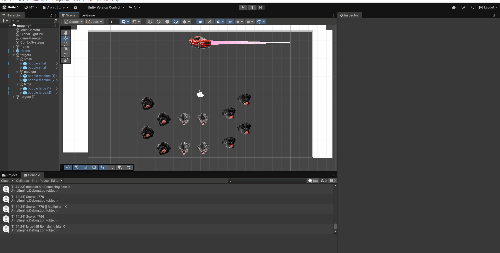
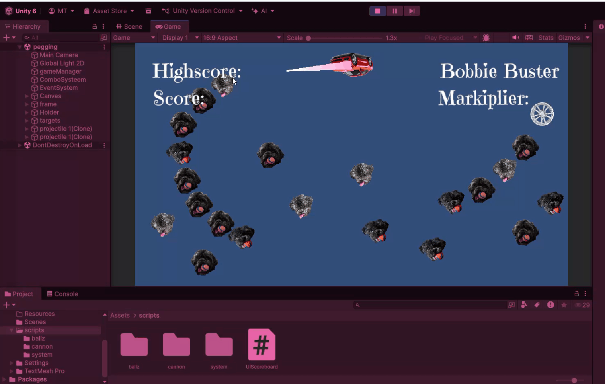

# GDV_Unity_peggle

sinds ik geen gifs heb van 1.1 tot 3.1 zal ik maar gewoon de gif sturen van 3.2 en proberen te herhalen wat ik had gedaan,

# **1.1**
ik had een concept gemaakt en gepresenteerd voor de klas.

# **1.2**
hier had ik een array/list/random item script gemaakt waar randomly er 1 gekozen werd en gedisplayed en een knop dat ze allemaal displayed.

# **2.1**
hier had ik de eerste instancie van mijn peggle gemaakt, mijn doos, mijn balletjes en de pegs en met een force de bal afschieten.

# **2.2**
hier had ik mijn knappe kanon gemaakt, die mikt, schiet en functioneerd

# **3.1**
hier had ik de scripts voor punten, en dat de ballen verwijdert werden, en ik had ook wat graphics toegevoegd maar ze hadden een background en niet echt een matchend theme.

# **3.2** 

ik heb alle graphics toegevoegd en gepolished
en ook de code geschreven om de bobbieballen te laten verdwijnen en de muliplier voor meerdere ballen aanraken en de combo's.

# **4.1** 

hier heb ik mijn canvas laten werken, deze was kort maar ik had er nogsteeds verassend veel problemen mee- (opgelost :D)